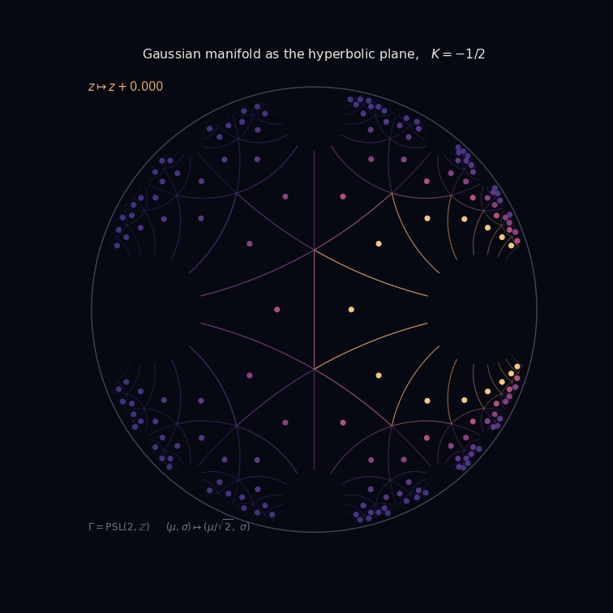

# `jayalengkara`: Fisher-Rao Information Geometry as a Computational Medium

[](https://www.python.org/downloads/)
[](https://pypi.org/project/jayalengkara/)
[](https://opensource.org/licenses/MIT)
[](https://github.com/psf/black)
[](https://numpy.org/)
[](https://scipy.org/)
[](https://matplotlib.org/)
[](https://pandas.pydata.org/)
[](https://unidata.github.io/netcdf4-python/)
[](https://numba.pydata.org/)
[](https://python-pillow.org/)
[](https://tqdm.github.io/)

> The nomenclature `jayalengkara` is drawn from **Prabu Jayalengkara**, the legendary ruler of the duchy of Surabaya, who from 1614 onward defended the sovereignty of his native land against the advancing power of the Sultanate of Mataram. His charismatic and unyielding leadership drew the duchies of East Java into a single alliance, and the resistance he sustained attested both to the military resilience of Surabaya and to the devotion of a populace prepared to fight to the last in defense of the honor of the city. Although the duchy was at length subdued by a protracted siege in 1625, the steadfastness and patriotic spirit of the Prabu endure as a respected emblem of resistance, honored even by his adversaries. The name is adopted here for a library whose concern is analogous in one respect: with structure that holds invariant under transformation.

<p align="center">
  
</p>

## Overview

`jayalengkara` treats the **Fisher-Rao metric** as an artistic and expository medium. A statistical family becomes a curved surface, its geodesics become drawable curves, and its information-theoretic quantities become the axes along which a figure is composed. The library ships four default cases that realize distinct and complementary pieces of information geometry, each rendered as an archival NetCDF file, a static PNG diagnostic panel, and an animated GIF.

The design separates computation from rendering. Every case writes its raw geometry, its frame coordinate, and all reproducibility parameters into a NetCDF archive that serves as the single source of truth; the PNG and GIF are functions of that archive. A downstream script can therefore regenerate any spatiotemporal figure from the `.nc` file alone.

Numerical kernels are compiled and parallelized with **Numba**. Grid-valued fields, batched transformations, and the diffusion ensemble are distributed across CPU cores. By default the library uses every available core, and the count is configurable from the command line or the configuration file.

**Key applications:**
- Information-geometric visualization and mathematical art
- Teaching the curvature, geodesics, and duality of statistical manifolds
- Exact reference geometry for exponential-family divergences
- Studying diffusion on curved statistical manifolds

## Mathematics

### Case 1: The Gaussian manifold as the hyperbolic plane

The univariate Gaussian family with coordinates `(mu, sigma)`, `sigma > 0`, carries the Fisher-Rao metric

$$ds^2 = \frac{d\mu^2 + 2\, d\sigma^2}{\sigma^2}.$$

This is the metric of the upper half-plane, of constant Gaussian curvature `K = -1/2`. Under the linear rescaling `x = mu / sqrt(2)` it becomes twice the standard Poincare half-plane metric in coordinates `(x, sigma)`, which fixes the curvature at one half the Poincare value. The plane is tiled by the modular group `PSL(2, Z)`, generated by the transformations

$$S: z \mapsto -1/z, \qquad T: z \mapsto z + 1.$$

The orbit is enumerated in exact integer arithmetic, so that products of near-boundary transformations lose no precision; floating point enters only when the tiles are drawn. The fundamental domain of `PSL(2, Z)` has hyperbolic area exactly `pi/3`, and the defining relations `S^2 = (ST)^3 = 1` hold as integer identities. These are reported as correctness diagnostics.

### Case 2: The categorical manifold as the sphere

The probability simplex with the Fisher metric `ds^2 = sum_i dp_i^2 / p_i` is isometric, under the square-root embedding `p -> 2 sqrt(p)`, to the positive octant of the sphere of radius two. The Fisher-Rao distance is

$$d(p, q) = 2 \arccos\left(\sum_i \sqrt{p_i q_i}\right),$$

and the constant curvature is `K = +1/4`. For three outcomes the octant is a spherical triangle, tiled here by recursive geodesic (great-circle) subdivision. The minimizing geodesic between two categorical distributions never leaves the simplex, because the positive orthant of the sphere is geodesically convex. The Shannon entropy over the family is rendered as a scalar field, and it attains its maximum `ln 3` at the uniform distribution.

### Case 3: The dually flat weave

Both families are exponential families and therefore carry a dually flat structure. For the Gaussian family the natural and expectation coordinates are

$$\theta = \left(\frac{\mu}{\sigma^2}, -\frac{1}{2\sigma^2}\right), \qquad \eta = (\mu,\ \mu^2 + \sigma^2).$$

The e-geodesics are straight lines in `theta`, the m-geodesics are straight lines in `eta`, and overlaying the two conjugate coordinate grids in `(mu, sigma)` produces the weave. The canonical divergence is the closed-form Gaussian Kullback-Leibler divergence,

$$D(p \parallel q) = \log\frac{\sigma_q}{\sigma_p} + \frac{\sigma_p^2 + (\mu_p - \mu_q)^2}{2\sigma_q^2} - \frac{1}{2}.$$

The generalized Pythagorean theorem states that for a triple `P, Q, R` whose m-geodesic from `P` to `Q` is Fisher-orthogonal to the e-geodesic from `Q` to `R`,

$$D(P \parallel R) = D(P \parallel Q) + D(Q \parallel R).$$

The library constructs such a triple and verifies the identity to machine precision, which is the headline correctness diagnostic. The visible asymmetry `D(p || q)` against `D(q || p)` is rendered as a signed field.

### Case 4: Brownian motion on the manifold

The diffusion is generated by half the Laplace-Beltrami operator of the Gaussian manifold. In the half-plane chart the operator carries no first-order term, so the driftless Ito system

$$dx = \sigma\, dW_1, \qquad d(\log \sigma) = dW_2 - \tfrac{1}{2}\, dt$$

realizes it, and the factor of two in the Gaussian metric only rescales diffusion time. Integrating `log sigma` keeps `sigma` strictly positive by construction. Two properties are worth stating precisely, because the naive summary is misleading. The mean of `sigma` is a martingale, so its expectation is conserved, while the expectation of `log sigma` drifts downward at rate one half. The law of `sigma` therefore fans out into a right-skewed lognormal rather than drifting uniformly toward larger variance. The sample paths escape to the boundary at infinity at a linear rate in Fisher-Rao distance, and it is this boundary escape, together with the martingale and the entropy growth of the ensemble, that the case is built to display.

## Numerical Methods

### Exact and closed-form geometry

Distances, geodesics, curvatures, and divergences are computed in closed form. The modular orbit uses exact integer matrices. Slerp is guarded against domain overflow in the arccosine. The exponential-family maps and their inverses are analytic. The diffusion integrates in the log-domain for exact positivity.

### Diagnostic metrics

| Metric | Case | Meaning |
|--------|------|---------|
| Fundamental-domain area | 1 | Exact hyperbolic invariant `pi/3` |
| Modular relations residual | 1 | Integer identity `S^2 = (ST)^3 = 1`, exactly zero |
| Curvature deviation | 1, 2 | Departure from constant `K` |
| Triangle-inequality violation | 2 | Metric consistency on the sphere |
| Geodesic-length residual | 2 | Closed form against integrated arc length |
| Pythagorean residual | 3 | Generalized Pythagorean identity, machine precision |
| Orthogonality residual | 3 | Fisher orthogonality of the dual tangents |
| Martingale deviation | 4 | Conservation of `E[sigma]` |
| Log-sigma slope | 4 | Downward drift of `E[log sigma]` |
| Escape rate | 4 | Linear growth of Fisher-Rao distance |

### Parallelism

Numba `prange` distributes the batched Mobius transformations, the distance and entropy fields, the divergence fields, and the diffusion ensemble across CPU cores. The thread count is set once per run from `n_cores`, where `0` selects every available core.

## Features

- Exact and closed-form Fisher-Rao geometry for two elementary families
- Dually flat exponential-family structure with a machine-precision correctness check
- Log-domain diffusion with exact positivity and honest asymptotics
- Numba JIT compilation and multi-core parallelism
- NetCDF4 (CF-1.8) archives that reproduce every spatiotemporal figure
- Static PNG diagnostics and animated GIFs from a dark, high-contrast palette
- Four comparable default cases with a cross-case comparison table

## Directory Structure

```
jayalengkara/
├── configs/                              # Case configuration files
│   ├── case1_gaussian_hyperbolic.txt     # Gaussian manifold, modular tessellation
│   ├── case2_categorical_sphere.txt      # Categorical manifold, octant subdivision
│   ├── case3_dual_weave.txt              # Dually flat weave
│   └── case4_hyperbolic_diffusion.txt    # Brownian motion of Gaussians
│
├── src/jayalengkara_fr/                  # Main package source
│   ├── __init__.py
│   ├── cli.py                            # Command-line interface
│   │
│   ├── core/                             # Core numerical algorithms
│   │   ├── geometry.py                   # Fisher-Rao primitives (Numba)
│   │   ├── cases.py                      # Case generators
│   │   ├── models.py                     # Model engine
│   │   └── diagnostics.py               # Correctness and content metrics
│   │
│   ├── io/                               # Input/output handlers
│   │   ├── config_manager.py             # Configuration parser
│   │   └── data_handler.py              # NetCDF/CSV writer
│   │
│   ├── visualization/                    # Animation and plotting
│   │   ├── animator.py                  # GIF and PNG diagnostics
│   │   └── palette.py                   # Custom colormaps and figure colors
│   │
│   └── utils/                            # Utilities
│       ├── logger.py                     # Run logging
│       └── timer.py                     # Performance profiling
│
├── tests/                                # Unit tests
│   ├── test_geometry.py                  # Geometry and identity tests
│   └── test_models.py                   # Engine envelope tests
│
├── outputs/                              # Generated results (runtime)
├── logs/                                 # Run logs (runtime)
├── pyproject.toml                        # Poetry build configuration
├── README.md                             # This file
├── LICENSE                               # MIT license
└── .gitignore
```

## Installation

**From PyPI:**
```bash
pip install jayalengkara
```

**From source:**
```bash
git clone https://github.com/sandyherho/jayalengkara.git
cd jayalengkara
pip install -e .
```

## Quick Start

**Command line:**
```bash
jayalengkara case1              # Gaussian hyperbolic tessellation
jayalengkara case3 --cores 8    # Dual weave using 8 cores
jayalengkara --all              # Run all four cases
```

**Python API:**
```python
from jayalengkara_fr import FisherRaoModel, ConfigManager, DataHandler, Animator

config = ConfigManager.validate_config({'case_type': 'dual_weave',
                                        'scenario_name': 'Dual Weave'})
model = FisherRaoModel(n_cores=8, verbose=True)
result = model.run(config)

DataHandler.save_netcdf('dual_weave.nc', result, config, 'outputs')
Animator.create_diagnostics(result, 'dual_weave_diagnostics.png', 'outputs')
Animator.create_gif(result, 'dual_weave.gif', 'outputs')

print(result['metrics']['pythagorean_residual'])
```

## Test Cases

All four cases are configured for direct comparison and share the output pipeline.

| Case | Manifold | Curvature | What animates | Headline diagnostic |
|------|----------|-----------|---------------|---------------------|
| 1 | Gaussian, hyperbolic plane | `-1/2` | Parabolic isometry flow `z -> z + s` | Fundamental-domain area `pi/3`, exact modular relations |
| 2 | Categorical, sphere | `+1/4` | Swarm circulating on geodesic circuits | Zero triangle-inequality violation, geodesic residual |
| 3 | Gaussian, dually flat weave | `-1/2` | Moving triple and evolving divergence field | Pythagorean residual at machine precision, every frame |
| 4 | Gaussian, diffusion | `-1/2` | Brownian walkers escaping to the boundary | Conserved `E[sigma]`, linear boundary escape |

### What the frame coordinate means

The animations are driven by genuine geometry, not by a turning camera. In case 1 the frame coordinate is the parameter of the parabolic isometry `z -> z + s`; because `T: z -> z + 1` belongs to the modular group, the tessellation maps exactly onto itself after one cycle, so the tiles stream toward the cusp and the loop closes seamlessly. In case 2 a swarm of categorical distributions circulates on closed circuits of great-circle arcs, which stay inside the simplex by geodesic convexity of the positive orthant, and each point is colored by its live Shannon entropy. In case 3 the reference distribution `Q` traverses a closed loop, so the dual-orthogonal triple, both geodesic legs, and the whole divergence field evolve together, and the Pythagorean identity is re-verified at every frame rather than at a single representative triple. In case 4 the frame coordinate is physical diffusion time.

### Palette and notation

Figures use four custom gradients registered under the `jl_` prefix, defined in `visualization/palette.py` and selectable by name from any configuration file. `jl_aurora` runs indigo to violet to amber for the hyperbolic tessellation, `jl_nacre` runs deep teal to pale cream for entropy on the simplex, `jl_duality` is a diverging teal to vellum to crimson ramp for signed divergence, and `jl_ember` runs midnight to rose to pale gold for the diffusion. The sequential ramps are monotonic in relative luminance and the diverging ramp peaks at its midpoint, so they remain readable as data while avoiding the laboratory connotations of stock scientific colormaps. Animations are drawn on a deep ink ground and printed diagnostics on warm vellum.

Where marks are drawn on the ink ground, the darkest part of a sequential ramp is indistinguishable from the background, so those renderers trim it with `palette.truncate`. This is a deliberate tradeoff: the diffusion animation keeps 62 percent of its hue range in exchange for raising the low end from a contrast ratio of 1.0 to 1 up to 2.1 to 1. Meeting the WCAG 3 to 1 threshold for graphical objects would require discarding half the ramp, which was judged too costly for the composition. The printed diagnostics use the full ramp, where the darkest end reaches 17.7 to 1 against vellum.

Parameters are labelled with their mathematical symbols throughout. Titles, axis labels, and annotations use mathtext, so the Gaussian coordinates appear as the Greek mu and sigma, the conjugate coordinates as theta and eta, the curvature as `K`, the divergence as `D(P||Q)`, and the isometry flow as `z` mapping to `z + s`. The monospace metric panels use the corresponding unicode letters directly, since mathtext would break their column alignment. Every figure is rendered under a check that promotes missing-glyph warnings to errors, so no label ships as a substitute box.

### Archival precision

Geometry is archived at single precision, which is ample for rendering. Series carrying a machine-precision claim, namely the per-frame Pythagorean residual, the divergence series, and the triple coordinates, are archived at double precision, so the identity can be re-verified from the NetCDF file alone rather than being limited by the storage format.

The cross-case table `outputs/comparison_metrics.csv` pairs each case with its correctness residual and a representative content metric.

## Citation

If you use this software in your study, please cite:

```bibtex
@software{Herho2026jayalengkara,
  title   = {{jayalengkara: Fisher-Rao Information Geometry as a Computational Medium}},
  author  = {Herho, Sandy H. S. and Biosa, Sito F. and Anwar, Iwan P. and Handayani, Alfita P. and Irawan, Dasapta E.},
  year    = {2026},
  version = {0.0.1},
  url     = {https://github.com/sandyherho/jayalengkara}
}
```

## Authors

- Sandy H. S. Herho (sandy.herho@email.ucr.edu)
- Sito F. Biosa
- Iwan P. Anwar
- Alfita P. Handayani
- Dasapta E. Irawan

## License

MIT License - See [LICENSE](LICENSE) for details.